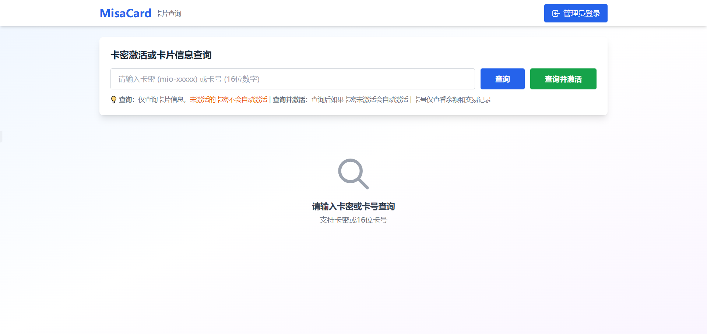
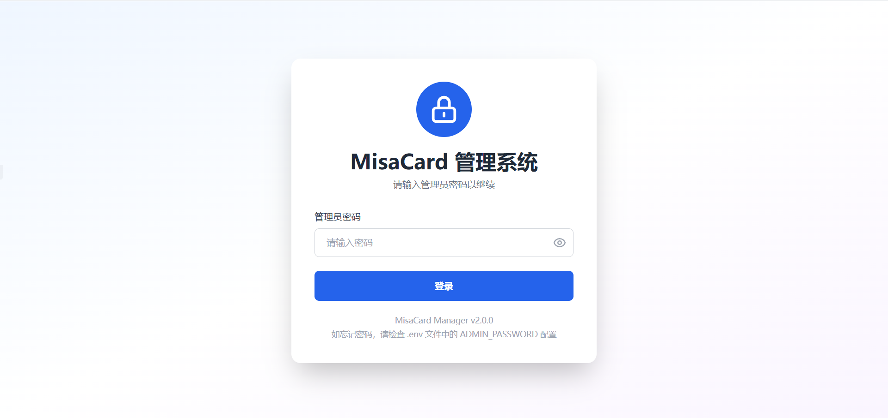
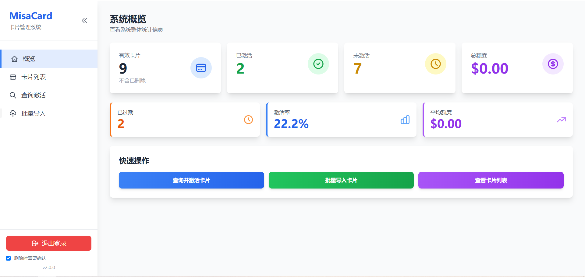
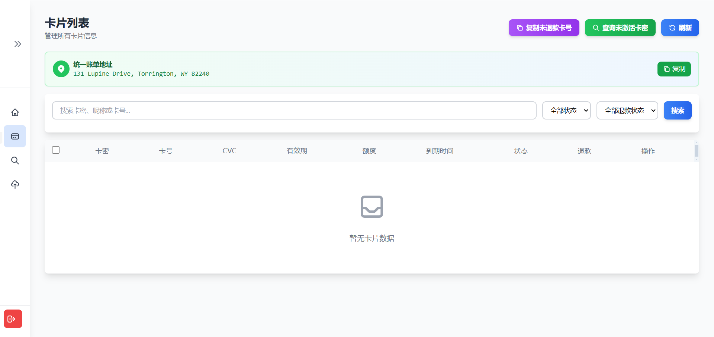

# MisaCard 管理系统

一个功能完善、安全可靠的虚拟卡管理系统，用于管理 MisaCard 虚拟信用卡，支持卡片激活、查询、批量导入、退款管理等功能。


## ✨ 功能特性

### 🔓 公共查询（无需登录）
- **卡密查询** - 通过卡密查询完整卡片信息（卡号、CVC、有效期等）
- **卡号查询** - 通过16位卡号查询余额和消费记录
- **按需查询交易** - 卡密查询后，点击"查询交易记录"按钮查看余额和消费记录
- **实时余额** - 查看可用额度、已入账、待处理金额
- **消费记录** - 查看详细的交易历史
- **一键复制** - 快速复制卡片信息
- **分离刷新** - 余额和消费记录可单独刷新

### 🔐 安全特性
- **分级访问** - 公共查询和管理后台分离
- **登录鉴权** - 管理后台需要密码登录
- **Session 管理** - 可配置的会话过期时间和安全策略
- **密钥管理** - 强制要求环境变量配置敏感信息

### 📋 核心功能
- **卡片管理** - 完整的 CRUD 操作（创建、读取、更新、删除）
- **自动激活** - 集成 MisaCard API，自动查询并激活虚拟卡
- **批量导入** - 支持 TXT/JSON 格式批量导入卡密
- **智能过期检测** - 自动检测并标记过期卡片
- **退款管理** - 跟踪和管理卡片退款申请
- **消费记录** - 查询卡片交易历史和余额信息

### 🎨 用户界面
- **现代化 Web 界面** - 基于 Tailwind CSS 的响应式设计
- **实时数据统计** - 卡片状态、额度、激活率等数据可视化
- **批量操作** - 支持批量标记退款、批量删除等操作
- **一键复制** - 快速复制已过期未退款卡号，并可自动标记
- **安全登录页** - 精美的登录界面，支持密码显示/隐藏

#### 界面预览





### 🔧 技术特性
- **RESTful API** - 标准的 REST API 设计
- **异步处理** - 基于 FastAPI 的异步请求处理
- **自动文档** - Swagger UI / ReDoc 自动生成 API 文档（需要登录访问）
- **数据验证** - Pydantic 模型验证
- **激活日志** - 完整的激活历史记录
- **Docker 支持** - 开箱即用的容器化部署

## 📦 技术栈

- **后端框架**: FastAPI 0.115.5
- **数据库**: SQLite + SQLAlchemy 2.0.36 ORM
- **服务器**: Uvicorn (ASGI)
- **数据验证**: Pydantic 2.10.3
- **HTTP 客户端**: httpx 0.28.1
- **模板引擎**: Jinja2 3.1.4
- **Session 管理**: Starlette SessionMiddleware + itsdangerous
- **前端样式**: Tailwind CSS

## 🚀 快速开始

### 方式一：Docker 部署（推荐）

#### 环境要求
- Docker 20.10+
- Docker Compose 1.29+

#### 部署步骤

1. **克隆项目**
```bash
git clone https://github.com/hydy100/MisaCard-Manager.git
cd MisaCard-Manager
```

2. **配置环境变量**
```bash
# 复制环境变量模板
cp .env.example .env

# 编辑 .env 文件，设置必要的配置
nano .env  # 或使用其他编辑器
```

**重要：必须配置以下环境变量：**
- `MISACARD_API_TOKEN` - 你的 MisaCard API Token
- `ADMIN_PASSWORD` - 管理员登录密码（建议使用强密码）
- `SECRET_KEY` - Session 加密密钥（使用 `python -c "import secrets; print(secrets.token_urlsafe(32))"` 生成）

3. **启动服务**
```bash
# 启动容器
docker-compose up -d

# 查看日志
docker-compose logs -f

# 停止服务
docker-compose down

# 停止并删除数据
docker-compose down -v
```

4. **访问系统**
- 打开浏览器访问: http://localhost:8000
- 使用 .env 中配置的 `ADMIN_PASSWORD` 登录

### 方式二：本地部署

#### 环境要求
- Python 3.12 或更高版本
- pip (Python 包管理器)

#### 安装步骤

**1. 克隆项目**
```bash
git clone https://github.com/hydy100/MisaCard-Manager.git
cd MisaCard-Manager
```

**2. 创建虚拟环境（推荐）**
```bash
# 创建虚拟环境
python3 -m venv venv

# 激活虚拟环境
# macOS/Linux:
source venv/bin/activate
# Windows:
venv\Scripts\activate
```

**3. 安装依赖**
```bash
pip install -r requirements.txt
```

**4. 配置环境变量**
```bash
# 复制环境变量模板
cp .env.example .env

# 编辑 .env 文件
nano .env  # 或使用其他编辑器
```

**必须配置的环境变量：**
```bash
# MisaCard API Token（必需）
MISACARD_API_TOKEN=your_actual_token_here

# 管理员密码（必需）
ADMIN_PASSWORD=your_strong_password

# Session 密钥（必需，使用以下命令生成）
# python -c "import secrets; print(secrets.token_urlsafe(32))"
SECRET_KEY=generated_secret_key_here

# 可选配置
DEBUG=false  # 生产环境设为 false
SESSION_MAX_AGE=86400  # Session 过期时间（秒）
```

**5. 初始化数据库**
```bash
# 创建数据库和表
python3 init_db.py init

# 检查数据库状态（可选）
python3 init_db.py check
```

**6. 启动服务**

```bash
# 开发模式（自动重载）
uvicorn app.main:app --reload --host 0.0.0.0 --port 8000

# 生产模式
uvicorn app.main:app --host 0.0.0.0 --port 8000 --workers 4
```

**7. 访问系统**
- 公共查询页: http://localhost:8000 （无需登录）
- 管理后台: http://localhost:8000/admin （需要登录）
- 登录页面: http://localhost:8000/login
- API 文档: http://localhost:8000/docs （需要登录）

## 🔒 安全说明

### 安全特性

1. **强制鉴权** - 管理后台页面和 API 端点需要登录才能访问
2. **Session 加密** - 使用 SECRET_KEY 对 Session 进行加密签名
3. **配置验证** - 启动时强制检查必需的环境变量
4. **Session 过期** - 可配置的会话超时时间
5. **CSRF 保护** - Session cookie 设置 SameSite=Lax

### 安全建议

**生产环境部署时，请务必：**
1. ✅ 使用强密码作为 `ADMIN_PASSWORD`
2. ✅ 生成随机的 `SECRET_KEY`（不要使用示例值）
3. ✅ 设置 `DEBUG=false`
4. ✅ 启用 HTTPS（在反向代理层如 Nginx）
5. ✅ 定期备份数据库文件
6. ✅ 使用防火墙限制访问
7. ✅ 定期更新依赖包

### 密钥生成

```bash
# 生成 SECRET_KEY
python -c "import secrets; print(secrets.token_urlsafe(32))"

# 生成强密码
python -c "import secrets; print(secrets.token_urlsafe(16))"
```

## 📖 使用说明

### 公共查询（无需登录）

访问首页 http://localhost:8000 即可使用公共查询功能：

1. **查询卡密**：输入完整卡密（如 `mio-xxxxx`）
   - 显示卡号、CVC、有效期、额度、账单地址等完整信息
   - 点击卡号旁边的"查询交易记录"按钮查看余额和消费记录
   - 可一键复制所有信息

2. **查询卡号**：输入16位卡号
   - 直接显示账户余额和消费记录
   - 适合只想查看余额的场景

3. **刷新数据**：点击"刷新"按钮可单独更新余额和消费记录

### 管理后台登录

访问 http://localhost:8000/admin 或点击首页右上角"管理员登录"：

1. 输入在 `.env` 中配置的 `ADMIN_PASSWORD`
2. 登录成功后进入完整管理系统
3. 会话保持状态（默认24小时）
4. 点击侧边栏底部的"退出登录"按钮可退出

### 卡片管理

#### 批量导入卡片
1. 进入「批量导入」页面
2. 粘贴卡片数据（支持多行）
3. 格式示例：
```
卡密: mio-xxxxx 额度: 1 有效期: 1小时
卡密: mio-xxxxx 额度: 2 有效期: 1小时
```
4. 点击「开始导入」
5. 导入的卡片状态为「未激活」

#### 激活卡片
- 方式一：在「查询激活」页面输入卡密，自动激活
- 方式二：在「卡片列表」中点击卡片的「激活」按钮

#### 退款管理
1. 在卡片列表中点击「标记退款」按钮
2. 或使用「复制未退款卡号」功能批量复制已过期未退款的卡号
3. 复制后可选择批量标记为已申请退款

#### 查看卡片详情
1. 点击卡片列表中的「详情」按钮
2. 查看完整的卡片信息、余额、消费记录等

## 📚 API 文档

系统提供了完整的 API 文档（**需要登录后才能访问**）：

- **Swagger UI**: http://localhost:8000/docs（需要登录）
- **ReDoc**: http://localhost:8000/redoc（需要登录）

**注意：** 访问文档页面前，请先通过 `/login` 页面登录系统。

### 主要 API 端点

#### 认证相关
- `POST /api/auth/login` - 登录（**公开**，无需登录）
- `POST /api/auth/logout` - 退出登录（**需要登录**）

#### 卡片管理（**需要登录**）
- `GET /api/cards/` - 获取卡片列表（支持搜索和过滤）
- `POST /api/cards/` - 创建新卡片
- `GET /api/cards/{card_id}` - 获取单个卡片详情
- `PUT /api/cards/{card_id}` - 更新卡片信息
- `DELETE /api/cards/{card_id}` - 删除卡片
- `POST /api/cards/{card_id}/activate` - 激活卡片
- `POST /api/cards/{card_id}/query` - 查询并更新卡片信息
- `POST /api/cards/{card_id}/refund` - 切换退款状态
- `GET /api/cards/{card_id}/logs` - 获取卡片激活历史记录
- `GET /api/cards/{card_id}/transactions` - 获取卡片交易记录
- `GET /api/cards/batch/unreturned-card-numbers` - 获取已过期未退款卡号列表

#### 批量导入（**需要登录**）
- `POST /api/import/text` - 文本批量导入
- `POST /api/import/json` - JSON 批量导入

#### 系统
- `GET /health` - 健康检查（**公开**，无需登录）
- `GET /api/info` - API 信息（**需要登录**）

**注意：** 
- 公共查询页面直接调用 MisaCard API，不经过后端服务器
- API 文档页面（`/docs`、`/redoc`）需要登录后才能访问
- **除 `/api/auth/login` 和 `/health` 外，所有其他 API 接口都需要登录后才能访问**
- 未登录访问受保护的 API 接口会返回 `401 Unauthorized` 错误

## 🐳 Docker 配置说明

### Dockerfile 说明

项目包含优化的 Dockerfile：
- 基于 Python 3.12-slim 镜像
- 分层构建，优化缓存
- 包含健康检查
- 自动创建数据目录

### docker-compose.yml 说明

提供完整的 docker-compose 配置：
- 自动环境变量映射
- 数据持久化（通过 volume）
- 健康检查配置
- 自动重启策略

### 数据持久化

数据库文件存储在 `./data/cards.db`，通过 Docker volume 挂载：
```bash
# 备份数据库
cp data/cards.db data/cards.db.backup

# 恢复数据库
cp data/cards.db.backup data/cards.db
```

### 常用 Docker 命令

```bash
# 查看容器状态
docker-compose ps

# 查看实时日志
docker-compose logs -f

# 重启服务
docker-compose restart

# 进入容器
docker-compose exec misacard-manager bash

# 查看资源使用
docker stats misacard-manager

# 更新镜像并重启
docker-compose pull
docker-compose up -d
```

## 🛠️ 开发

### 项目结构

```
MisaCard-Manager/
├── app/
│   ├── __init__.py
│   ├── main.py              # 主应用入口
│   ├── config.py            # 配置管理
│   ├── models.py            # 数据库模型
│   ├── schemas.py           # Pydantic 模型
│   ├── crud.py              # 数据库操作
│   ├── database.py          # 数据库连接
│   ├── api/
│   │   ├── cards.py         # 卡片 API 路由
│   │   └── imports.py       # 导入 API 路由
│   ├── templates/
│   │   ├── index.html       # 管理后台页面
│   │   ├── query.html       # 公共查询页面
│   │   └── login.html       # 登录页面
│   ├── static/              # 静态文件
│   └── utils/
│       ├── activation.py    # 激活逻辑
│       └── parser.py        # 数据解析
├── data/                    # 数据目录（Docker）
├── .env                     # 环境变量配置
├── .env.example             # 环境变量模板
├── requirements.txt         # Python 依赖
├── Dockerfile               # Docker 镜像配置
├── docker-compose.yml       # Docker Compose 配置
├── .dockerignore            # Docker 忽略文件
├── init_db.py               # 数据库初始化脚本
└── README.md                # 项目文档
```

### 运行测试

```bash
# 安装测试依赖（已包含在 requirements.txt）
pip install pytest pytest-asyncio

# 运行测试
pytest

# 查看覆盖率
pytest --cov=app
```

### 开发建议

1. 使用虚拟环境隔离依赖
2. 启用 DEBUG 模式方便调试
3. 代码修改后自动重载（`--reload` 参数）
4. 使用 API 文档测试接口

## ⚙️ 环境变量配置

| 变量名 | 必需 | 默认值 | 说明 |
|--------|------|--------|------|
| `MISACARD_API_TOKEN` | ✅ | - | MisaCard API 访问令牌 |
| `ADMIN_PASSWORD` | ✅ | - | 管理员登录密码 |
| `SECRET_KEY` | ✅ | - | Session 加密密钥 |
| `MISACARD_API_BASE_URL` | ❌ | `https://api.misacard.com/api/card` | API 基础 URL |
| `DATABASE_URL` | ❌ | `sqlite:///./cards.db` | 数据库连接字符串 |
| `DEBUG` | ❌ | `true` | 调试模式 |
| `SESSION_MAX_AGE` | ❌ | `86400` | Session 过期时间（秒） |

## 🔄 数据库管理

### 使用 init_db.py 脚本

```bash
# 初始化数据库（创建表）
python init_db.py init

# 检查数据库状态
python init_db.py check

# 清空所有数据（危险操作！）
python init_db.py clear

# 完全重置数据库
python init_db.py reset
```

### 手动备份

```bash
# 备份数据库
cp cards.db cards.db.backup-$(date +%Y%m%d)

# 恢复数据库
cp cards.db.backup-20231201 cards.db
```

## 🚨 故障排除

### 常见问题

#### 1. 启动时提示环境变量未设置

**错误信息：**
```
ValueError: ADMIN_PASSWORD 环境变量未设置！请在 .env 文件中配置
```

**解决方法：**
- 确保 `.env` 文件存在
- 检查 `.env` 文件中是否有 `ADMIN_PASSWORD=your_password`
- 确保没有拼写错误

#### 2. 登录后立即跳转回登录页

**可能原因：**
- `SECRET_KEY` 未设置或每次重启都变化
- Session cookie 配置问题

**解决方法：**
- 在 `.env` 中设置固定的 `SECRET_KEY`
- 清除浏览器 Cookie 后重试

#### 3. Docker 容器无法启动

**解决方法：**
```bash
# 查看详细日志
docker-compose logs

# 检查环境变量
docker-compose config

# 重建镜像
docker-compose up -d --build
```

#### 4. 无法访问 MisaCard API

**解决方法：**
- 检查 `MISACARD_API_TOKEN` 是否正确
- 检查网络连接
- 查看 API 响应日志

## 📄 许可证

本项目采用 MIT 许可证。详见 [LICENSE](LICENSE) 文件。

## 🤝 贡献

欢迎提交 Issue 和 Pull Request！

## 📮 联系方式

如有问题或建议，请通过以下方式联系：
- GitHub Issues: [提交 Issue](https://github.com/hydy100/MisaCard-Manager/issues)

## 🙏 致谢

感谢所有贡献者和使用本项目的用户！

---

**重要提示：** 本系统已集成完整的登录鉴权功能，可以安全地部署在公网环境。但仍建议：
- 使用强密码
- 启用 HTTPS
- 配置防火墙
- 定期更新依赖
- 定期备份数据
